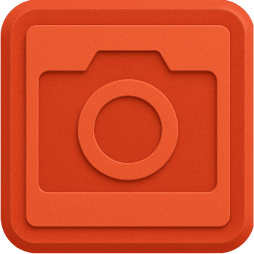

<div align="center">



### beveled — 3D device mockups from your screenshots

Drop a screenshot or screen recording onto a real-looking iPhone, iPad, MacBook, display, browser window or watch, animate it on a timeline, and export images or video. Everything renders in your browser.

</div>

## About

Beveled is an open-source web app and Chrome extension for turning screenshots into polished 3D product shots and short launch videos. It is modelled on tools like UltraMock and shots.so (see `docs/ultramock-audit.md` and `docs/shots-audit.md`), with Beveled's tangerine branding and no paywall.

- **Web app** — `/editor` is the 3D mockup editor; upload, drag and drop, or paste a screenshot or video.
- **Chrome extension** — capture the visible tab, the full page or an emulated device viewport, and the capture opens straight in the 3D editor.
- **Private** — no servers. Images, video and exports never leave your machine.

The original 2D screenshot beautifier is still available at `/classic`.

## Features

**Devices** — procedural models built from real-world dimensions (1 scene unit = 100 mm), with physically based finishes, coated camera lenses, buttons, ports, speaker grilles and more:
iPhone 17 Pro, 17 Pro Max, 17 and Air · Pixel 10 Pro and Galaxy S25 Ultra · iPad Pro 13", iPad Pro 11" and iPad Air · MacBook Pro 14", 16" and MacBook Air 13" (adjustable lid, notch, instanced keyboard) · Studio Display and Pro Display XDR · Watch Ultra 3 and Watch Series 11 · a floating browser window (Safari / Chrome / Arc, light or dark) · a bare rounded screen · **your own .glb model** (meshes named "screen" or "display" receive the media).

**Screen** — cover / contain / stretch fitting, landscape rotation, padding and letterbox colour, optional iOS status bar, glass reflection layer, image or looping video.

**Camera** — drag to orbit, scroll to zoom, shift-drag to pan; yaw, pitch, roll, FOV, zoom and pan sliders; seven camera presets.

**Timeline (UltraMock-style)**
- Clips play back to back: **shots** (each with its own full scene), **text** cards and **logo** cards, plus an **audio** track.
- **Simple** view: one row of clips with cut / fade transitions at every junction and drag handles for duration and order.
- **Advanced** view: a track per clip; shots expand into keyframe lanes. Drag diamonds to retime, click the curve button between two keyframes for the bezier **easing editor** (In / In Out / Out and eight presets).
- Every animatable slider has a ◇ keyframe button, and **Record keyframes** auto-keys every change at the playhead.
- **Motion presets**: scan left-to-right, top-to-bottom, low-angle pan up, slow zoom out, push in, overhead pan, out and back, fold up (opens a laptop lid), flat truck, orbit, hero reveal and spin reveal.
- Idle loops (float, sway, spin, orbit) layer on top of keyframes.
- Text cards: 30 fonts, weight, size, spacing, line height, alignment, colour, background; enter / exit per line, word or character with eleven effects; `{one|two|three}` word cycling.
- Logo cards: upload a PNG/SVG, liquid-metal / gem-smoke / heatmap fills, fade / scale / blur / rise in and out.

**Scene** — solid, linear, radial and image backgrounds (with blur and grain), a palette generated from your screenshot, 16 presets; seven Lightformer lighting setups built in-app (no HDR downloads) with keyframable rotation, tilt and intensity; contact shadows; reflective floor.

**Depth** — tilt-shift, radial and directional focus blur with a draggable focus handle, plus true lens depth of field with autofocus on the screen.

**Effects** — bloom, vignette, grain, chromatic aberration, sharpen, fish-eye, exposure, brightness, contrast, shadows, midtones, highlights, saturation and hue.

**Frames** — auto, 16:9, 1:1, 4:5, 9:16, 3:2, 4:3, 21:9, custom, and platform sizes for Instagram, X, YouTube, LinkedIn, Pinterest, Dribbble, Product Hunt and the App Store.

**Templates** — 14 templates with rendered previews, including four animated multi-clip timelines (Product Launch, App Showcase, Feature Tour, Desk Reveal).

**Export** — PNG, JPEG or WebP at 1×–4× with optional transparency; **MP4 or WebM video of the whole timeline**, rendered frame by frame through WebCodecs (via mediabunny) at 720p–4K, 24/30/60 fps, with the audio track mixed in. Browsers without WebCodecs fall back to real-time WebM recording.

**Keyboard** — Space play/pause · ⌘/Ctrl+Z undo · ⇧⌘Z redo · ⌘/Ctrl+E export image · Home back to start · , and . step one frame · Delete removes the selected keyframe · Esc closes panels.

## Tech stack

- React 19, TypeScript 5, Vite 7, Tailwind CSS v4, shadcn/ui (Radix)
- three.js, @react-three/fiber, @react-three/drei, @react-three/postprocessing / postprocessing
- zustand for editor state (undo/redo, localStorage persistence)
- mediabunny (WebCodecs) for MP4/WebM encoding
- Chrome Extension MV3 (service worker, content script, DevTools protocol for viewport emulation)

## Project structure

```
src/
  mockup/                 # 3D mockup editor (routes /editor and editor.html)
    types.ts              # Scene state types
    presets.ts            # Devices, finishes, lighting, backgrounds, camera presets, frames, templates
    store.ts              # zustand store: project of clips, undo/redo, keyframing, playback, export requests
    timeline/             # Clip / keyframe types, easing, sampling, motion presets, text & logo card drawing
    scene/                # R3F scene: device models, screen shader, camera rig, lights, background,
                          #   floor, post-processing (custom focus blur, grade, fade), export bridge
    ui/                   # Top bar, icon rail, panels, stage, timeline, templates dialog
  editor/                 # Classic 2D editor (route /classic)
  popup/                  # Extension popup
  background.ts           # MV3 service worker — capture logic
  content-script.ts       # Full-page stitching & viewport simulation
  App.tsx                 # Web app routes: home, /editor, /classic, /terms
docs/                     # UltraMock and shots.so audits used as the product spec
public/templates/         # Rendered template previews
```

## Getting started

Requirements: Node.js ≥ 20 and pnpm ≥ 9.

```bash
pnpm install
pnpm dev        # http://localhost:5173 — open /editor
```

## Commands

```bash
pnpm dev       # Start the Vite dev server (web app)
pnpm build     # Type-check and build the extension + web app into dist/
pnpm preview   # Serve the production build
pnpm lint      # Run ESLint
```

## Chrome extension

1. `pnpm build`
2. Open `chrome://extensions`, turn on Developer mode, click **Load unpacked** and choose `dist/`.
3. Capture from the popup. The capture is stored in `chrome.storage.local` as `latestCapture` and `editor.html` opens it in the 3D editor.

## How it works

- Each **shot** stores a full scene (device, camera, background, lighting, depth, effects, idle motion) plus keyframe tracks. The renderer always shows the clip under the playhead and samples keyframes every frame, so preview and export use the same code path.
- Devices are built from millimetre specs in `src/mockup/scene/models.ts`. Screens use a shader that fits the media (cover / contain / stretch, padding, rotation).
- Lighting is an environment map rendered from drei Lightformers, a studio dome and a front softbox, so no HDR files are downloaded.
- Video export pauses the render loop and steps the timeline one frame at a time, drawing each frame into a WebCodecs encoder with exact timestamps. Video media are seeked per frame, so exports are deterministic.

## Deploying the web app (Vercel)

- Framework preset: Vite
- Install command: `pnpm i --frozen-lockfile`
- Build command: `pnpm build`
- Output directory: `dist`

Add `vercel.json` at the repo root to support SPA routes:

```json
{
  "routes": [
    { "handle": "filesystem" },
    { "src": "/.*", "dest": "/index.html" }
  ]
}
```

## Contributing

1. Fork the repo and create a feature branch.
2. Run `pnpm dev` and/or `pnpm build`.
3. Make sure `pnpm lint` and `pnpm build` pass.
4. Open a pull request with a clear description and screenshots for UI changes.

## License

MIT — see `LICENSE`.

---

Made with ❤️ to help you make your screenshots better.
